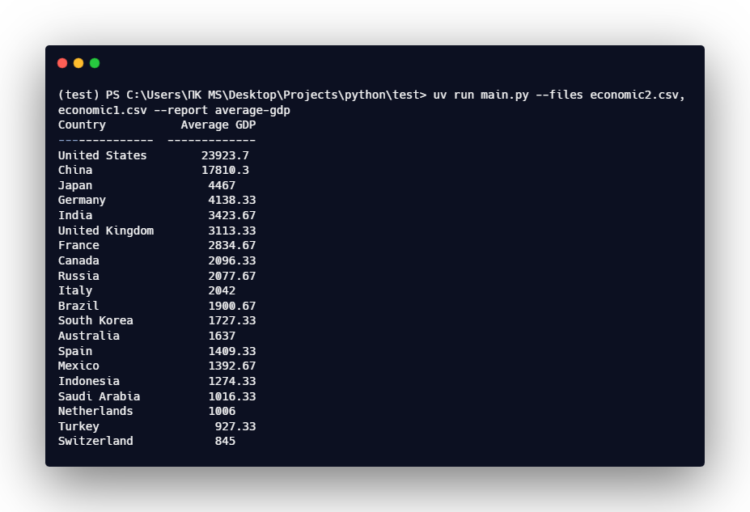
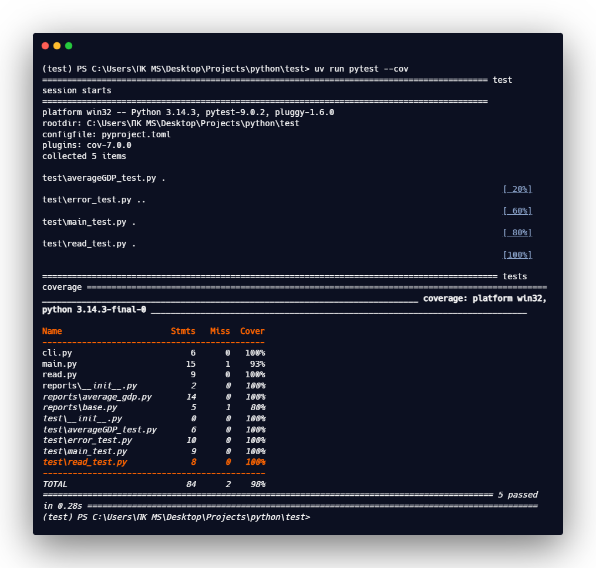

# 📊 CSV Report Generator

Утилита командной строки для генерации отчётов на основе CSV‑файлов.  
На текущий момент доступен один отчёт — **average-gdp**, который вычисляет средний ВВП по странам.

---

## 📁 Структура проекта

```text
project/
│ main.py              — основной модуль, объединяющий всю логику
│ cli.py               — обработка аргументов командной строки (--files, --report)
│ read.py              — чтение и объединение CSV‑файлов
│
├── reports/           — модуль с реализациями отчётов
│     base.py              — базовый класс отчёта
│     average_gdp.py       — отчёт "average-gdp"
│     __init__.py          — реестр доступных отчётов
│
└── test/              — тесты для cli, main, read, average_gdp и обработки ошибок
```

---

## 🚀 Возможности

- Чтение одного или нескольких CSV‑файлов
- Агрегация данных в единую структуру
- Генерация отчётов на основе расширяемой архитектуры
- Красивый вывод таблиц с помощью `tabulate`
- Обработка ошибок при некорректном запуске

---

## ▶️ Запуск проекта

Установка зависимостей:

uv sync

Запуск генерации отчёта:

uv run main.py --files file1.csv file2.csv --report average-gdp



---

## 🧪 Запуск тестов

uv run pytest -q




---

## 📦 Используемые библиотеки

- `pytest` — тестирование
- `tabulate` — форматирование таблиц
- `csv` — чтение CSV‑файлов
- `argparse` — обработка аргументов CLI
- `statistics` — вычисление среднего значения

---

## 📄 Описание модулей

### `cli.py`
Обрабатывает аргументы командной строки:

- `--files` — список CSV‑файлов
- `--report` — название отчёта

### `read.py`
Читает переданные CSV‑файлы и возвращает список словарей.

### `main.py`
Главная точка входа:

- парсит аргументы
- проверяет корректность отчёта
- читает данные
- вызывает генератор отчёта
- выводит таблицу

### `reports/`
Содержит:

- базовый класс отчёта (`BaseReport`)
- реализацию отчёта `AverageGDPReport`
- реестр доступных отчётов (`REPORTS`)

---

## ➕ Добавление нового отчёта

1. Создать файл в `reports/`, например `population.py`
2. Наследовать `BaseReport`
3. Реализовать метод `generate()`
4. Зарегистрировать отчёт в `reports/__init__.py`
